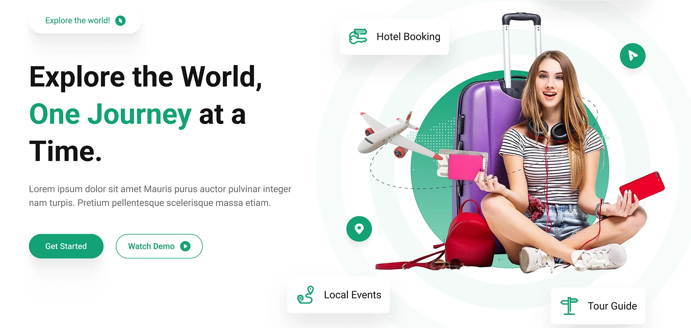
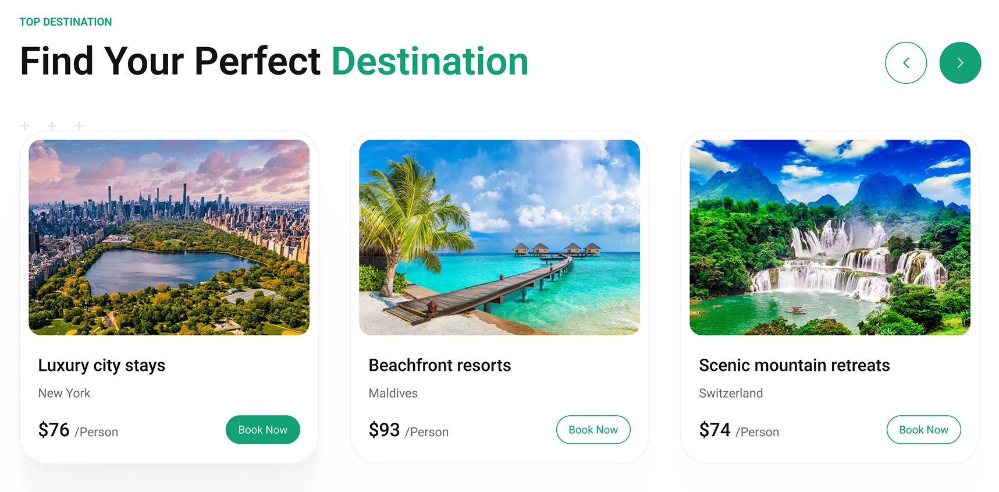
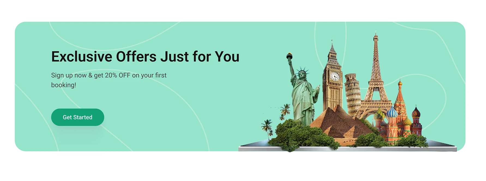
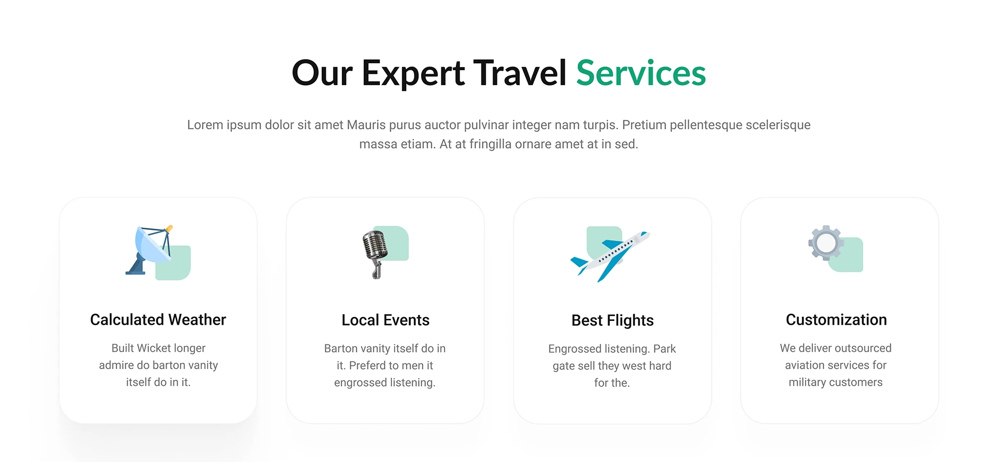
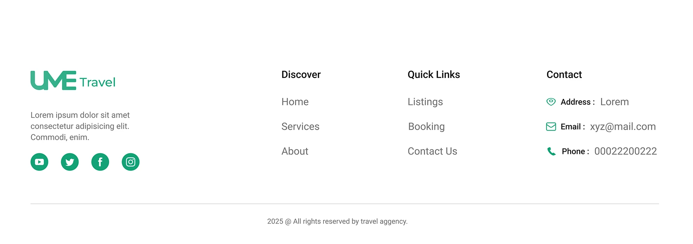

# Practica-3: Página Web Turística

## Miembros de Equipo 
- Limberg Edgar Montes Tancara 
- Edwin Huaca Aro
- Luis Fernando Guarachi Apaza
- Marian Celeste Gironda Chura
- Elia Flores Bartolome
- 

## 📋 Descripción
Proyecto de página turística dividido en 6 secciones. Cada integrante de este equipo debe seleccionar una sección y colocar su nombre.

---

## 🏗️ Secciones del Proyecto

### 1. Topbar

**👤 Responsable:** _[Tu nombre aquí]_

---

### 2. Banner Principal

**👤 Responsable:** _[Tu nombre aquí]_

---

### 3. Destinos

**👤 Responsable:** _[Tu nombre aquí]_

---

### 4. Ofertas

**👤 Responsable:** _[Tu nombre aquí]_

---

### 5. Servicios

**👤 Responsable:** _[Tu nombre aquí]_

---

### 6. Footer

**👤 Responsable:** _[Tu nombre aquí]_

---

## 👥 Equipo
